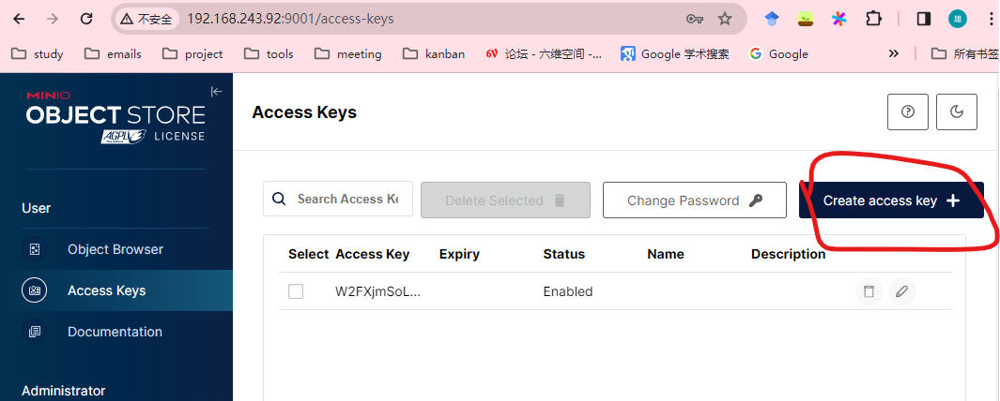
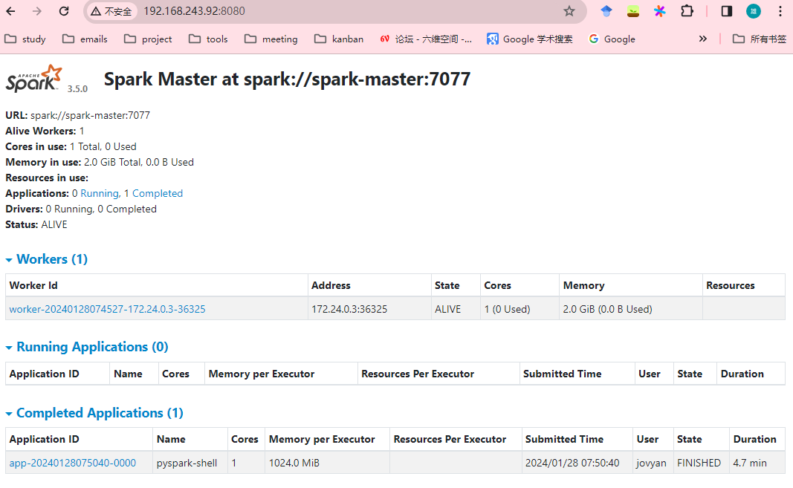
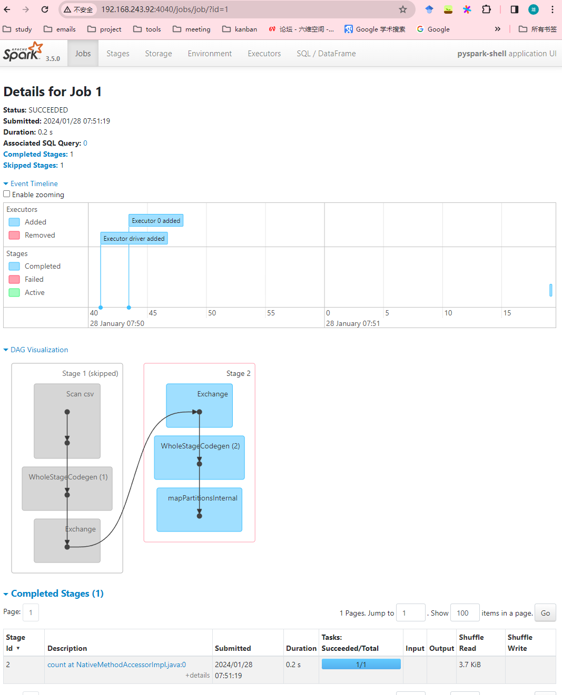

# Dev cluster搭建

## 1.安装

前提：docker和docker-compose已经安装

1.拉起容器

```bash
make up
```

2.到 [minio中国下载](http://dltest.minio.org.cn/client/mc/release/) 下载mc客户端

3.添加dev集群到mc
```bash
mc config host add dev http://localhost:9000 minio minio123 --api s3v4
```

4.创建minio的accesskey/secret, 并保存到本地


5.使用minio的access key信息更新`.env`文件
```
# AWS_REGION is used by Spark
AWS_REGION=us-east-1
# This must match if using minio
MINIO_REGION=us-east-1
# Used by pyIceberg
AWS_DEFAULT_REGION=us-east-1
# AWS Credentials (this can use minio credential, to be filled in later)
AWS_ACCESS_KEY_ID=qUgyOn1f3rbQkXAgCYLa
AWS_SECRET_ACCESS_KEY=MJA9lmnlESWEJZgmJ5Itdee94DUF16wSMfyhsIzT
# If using Minio, this should be the API address of Minio Server
AWS_S3_ENDPOINT=http://minio:9000
# Location where files will be written when creating new tables
WAREHOUSE=s3a://openlake/
# URI of Nessie Catalog
NESSIE_URI=http://nessie:19120/api/v1
GRANT_SUDO=yes
```

重新拉起容器
```
make up
```


## 2.数据准备
1.创建bucket openlake/spark/sample-data/

```bash
# 输入bucket
mc mb dev/openlake/spark/sample-data/
# 输出bucket
mc mb dev/openlake-tmp/spark/nyc/taxis_small
```

2.下载出租车数据拷贝到minio中

```bash
wget  https://data.cityofnewyork.us/api/views/t29m-gskq/rows.csv ./
mc cp rows.csv dev/openlake/spark/sample-data/
```


## 3.运行spark任务
1.网页访问jupyter地址: <localhost:8888>

2.运行`spark-minio.py`脚本

```bash
python3 spark-minio.py
```

3.查看spark管理页面:<localhost:8080>和jupyter的4040端口<localhost:4040>，分别可以查看运行的application信息和job的详情信息

application信息：


job详情:


4.等待python执行完毕，查看结果，可以看到外面算出来超过6名乘客的taxi为898
```bash
jovyan@jupyter-lab:~$ python3 spark-minio.py 
Setting default log level to "WARN".
...
2024-01-28 07:55:20,121 - MinIOSparkJob - INFO - Total Rows for NYC Taxi Data: 91704300               
2024-01-28 07:55:20,121 - MinIOSparkJob - INFO - Total Rows for Passenger Count > 6: 898
```

## 4.使用pyspark-iceberg管理table
1.创建`warehouse` bucket

```bash
mc mb dev/warehouse
```

2.运行`spark-iceberg-minio.py`

```bash
python3 spark-iceberg-minio.py
```
3.TODO(查看结果)


# 参考

<https://www.cnblogs.com/rongfengliang/p/17970071>
<https://github.com/minio/openlake/tree/main>
<https://www.linkedin.com/pulse/creating-local-data-lakehouse-using-alex-merced/>
<https://medium.com/@ongxuanhong/dataops-02-spawn-up-apache-spark-infrastructure-by-using-docker-fec518698993>
<https://medium.com/@ongxuanhong/are-you-looking-for-a-powerful-way-to-streamline-your-data-analytics-pipeline-and-produce-cc13ea326790>